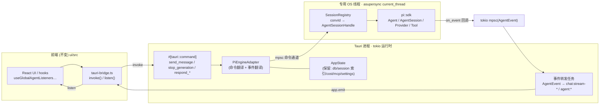

# uClaw 后端 Agent 框架迁移到 pi_agent_rust —— 集成方案与实施策略分析

> 版本 v1.0 · 2026-05-30 · 作者 Ryan Liu
>
> 目标：**完全弃用 uclaw-pi 现有后端 Agent 实现**，将 `/Users/ryanliu/Documents/pi_agent_rust`（二进制名 `pi`，库名 `pi`）的 Agent 框架、服务与功能设计**完整迁移并应用**到 uClaw 桌面应用；**复用现有前端 UI/UX 不变**。
>
> 本文给出：现状架构盘点 → 目标框架剖析 → 关键约束论证 → 集成方案权衡（库嵌入 vs sidecar vs 混合）→ 推荐方案与详细架构 → 前端契约适配映射 → 代码层重构映射 → 分阶段实施路线图 → 风险与验证门禁。

---

## 0. 执行摘要（TL;DR）

1. **可行性结论：可行，但不是"直接 link 调用"那么简单。** pi 提供了**明确、稳定、专为嵌入设计的库 API**（`pi::sdk`，含可运行示例 `examples/basic_sdk.rs`），Agent 循环（`Agent` / `AgentSession` / `AgentSessionHandle`）与 CLI/TUI 完全解耦。这是迁移能成立的前提。

2. **最大障碍是异步运行时不兼容。** pi **不使用 tokio**，而是使用自研运行时 **`asupersync =0.3.2`** 作为执行器、`Mutex`、通道与定时器；其整个 `src/` 中只有 1 处无关紧要的 `tokio::` 引用。而 **Tauri 建立在 tokio 之上**。两个运行时在"执行器/poll"层面不可互通——**不能直接 `tokio::spawn` 一个 pi 的 SDK future**。这是决定集成形态的核心约束。

3. **次要约束：** pi 为 **edition 2024 / rust 1.85**（`rust-toolchain.toml` 锁 `nightly`，但这是 pi 自身开发用；作为依赖只需消费端工具链 ≥ 1.85），release profile 为 `panic = "abort"`；uClaw 当前为 **edition 2021 / rust 1.78**。需要抬升 uClaw 工具链基线。

4. **推荐方案（兼顾"库 crate 直接嵌入"诉求与运行时现实）：**
   **进程内库嵌入 + 专用 asupersync 运行时线程 + 通道桥（"Engine Actor"模式）。** 即把 `pi` 作为依赖直接编译进 uClaw 进程，但让所有 pi future 运行在一条**专用 OS 线程**上的 `asupersync` `current_thread` 运行时里；Tauri/tokio 侧通过 **mpsc 命令通道**下发请求，pi 的 `on_event` 回调把 `AgentEvent` 推回 **tokio 通道**，由转发任务翻译成现有 `chat:stream-*` / `agent:*` Tauri 事件。这样既满足你选择的"作为库 crate 直接嵌入"，又彻底规避双运行时互 poll 的问题。

5. **建议把 sidecar（RPC）作为 Phase 0 的去风险探针与永久回退路径**，而非最终形态。pi 的 SDK 已内置 `SessionTransport::{InProcess, RpcSubprocess}` 双形态与 `pi --mode rpc` 协议，能让你在 1–2 天内打通端到端链路、验证契约映射，再平滑切换到进程内嵌入。

6. **迁移的"不变量"是前端契约**：新后端必须继续 `emit` 这组事件并保留这组命令名/入参形状（详见 §6）。整个契约集中在 `ui/src/lib/tauri-bridge.ts`，**前端零改动**的关键就是适配层 1:1 复刻这些字符串与 payload。

> ✅ **R0 已完成（2026-05-30）：GO（权威覆盖本文工具链表述）。** 进程内嵌入可行、全程 **stable**、F3 NO-GO 未触发（无 nightly / 无 `#![feature]`）。**工具链下限修正：不是 1.85，而是较新 stable（>1.88，实测 1.95.0；R1+ 钉 `1.95`）——本文凡「stable ≥1.85 / rust 1.85」均以此为准。** 卡点三级台阶（皆 stable 版本下限，非 nightly）：1.85❌（pi build-dep `vergen-gix`/`sysinfo`/`time`/`cargo_metadata` MSRV→1.88）、1.88❌（`asupersync 0.3.2` 用 unstable `Duration::from_mins`）、1.95✅。§6.1 流式 seam 与运行时隔离已端到端验证。详见 `r0-pi-spike/R0-VERDICT.md`、复刻计划 §0B、执行追踪表 `docs/MIGRATION_GOALS.md`。

---

## 1. 现状盘点：uClaw 后端 Agent 架构

uClaw 后端库 crate 名为 `uclaw_core`（位于 `src-tauri/`）。两个超大文件主导：`src-tauri/src/tauri_commands.rs`（~734 KB，约 382 个命令）与 `src-tauri/src/mcp.rs`（~146 KB）。

### 1.1 Agent 执行内核（待弃用）

- **主循环**：`src-tauri/src/agent/agentic_loop.rs`（2916 行）
  入口：`pub async fn run_agentic_loop(delegate: &dyn LoopDelegate, reason_ctx: &mut ReasoningContext, config: &AgenticLoopConfig) -> LoopOutcome`
  循环是**委托驱动**的：它拥有迭代、取消、token 预算/压缩、工具意图提示、回合边界；每个有副作用的步骤都是 trait 调用。
- **委托 trait**：`LoopDelegate`（`src-tauri/src/agent/types.rs:351`），关键方法 `check_signals / before_llm_call / call_llm / handle_text_response / execute_tool_calls / on_usage / create_turn_snapshot / prepare_next_turn / get_steering_messages / get_follow_up_messages` + 压缩钩子。
- **状态载体**：`ReasoningContext`（`types.rs:50`）持 `messages: Vec<ChatMessage>`、`system_prompt`、`thread_state`、累计 token 计数、取消句柄等。`TurnSnapshot`（`agent/turn.rs`）冻结每回合的 model+system_prompt+tools。出口枚举 `LoopOutcome`。
- **生产委托**：`ChatDelegate`（`src-tauri/src/agent/dispatcher/mod.rs:72`，拆分到 `dispatcher/{turn_runner,content_assembler,model_io,observability,safety_gate}.rs`）。持 `llm: Arc<dyn LlmProvider>`、`tools: Arc<ToolRegistry>`、`app_handle: tauri::AppHandle`、model，以及 learning / gbrain / GEP / 遥测管道。**`ChatDelegate` 不进 state，每次 `send_message`/`send_agent_message` 调用现场从 `AppState` 构造。**
- **LLM provider 抽象**：`trait LlmProvider`（`src-tauri/src/llm/provider.rs`），`complete(...)` 与 `stream(...) -> Stream<Item=Result<StreamDelta>>`。实现为 `AnthropicProvider` 与 `OpenAIProvider`（`src-tauri/src/llm/providers/`）——**手写 reqwest SSE 客户端**（无官方 SDK），含重试/停顿超时。选择逻辑 `create_provider(config) -> Arc<dyn LlmProvider>`（`llm/mod.rs:29`）。流式重试/中止：`agent/llm_stream.rs` 的 `stream_completion(...)` + `StreamSink` trait。
- 另有 `regular_task.rs` / `headless.rs`（自动化委托）与 `symphony_graph/runtime/node_run.rs`（第三个 `run_agentic_loop` 调用方）。

### 1.2 工具系统（待弃用 / 适配）

- `trait Tool`（`agent/tools/tool.rs`：`name() / execute() / execute_streaming()`）+ `ToolRegistry`。
- 线缆类型在 `crates/uclaw-tool-types`：`ToolCall{id,name,arguments}`、`ToolDefinition{name,description,parameters}`。
- 内置工具：`agent/tools/builtin/`（file/edit/shell/search/web/ask_user/plan*/load_skill*/self_eval/get_file_skeleton + 浏览器工具族）。注册装配在 `agent/tools/registry_build.rs::build_tool_registry(...)`。
- 派发：`agent/tool_dispatch/mod.rs`，执行 + 安全/审批（emit `agent:need_approval` / `agent:tool-rejected`）+ start/result 事件。
- **MCP**：客户端 `src-tauri/src/mcp.rs`（JSON-RPC over stdio，自动重连健康循环）；桥接到注册表 `agent/tools/mcp/mod.rs`；uClaw 作为 MCP server 在 `mcp_server/`。Manager 在 `AppState.mcp_manager`。

### 1.3 会话 / 状态 / 持久化（保留为主）

- **活动会话**：`Session{messages:Vec<ChatMessage>,...}` + `SessionManager`（`agent/session.rs`），在 `AppState.session_manager: Arc<RwLock<SessionManager>>`，惰性从 SQLite 加载。
- **DB**：SQLite（rusqlite），`db/{manager,migrations}.rs`；`AppState.db: Arc<Mutex<Connection>>`，路径 `~/.uclaw/.../uclaw.db`；表含 `conversations / messages / 成本 / task_events_rollout`。
- **记忆**：`memory.rs`(`MemoryStore`) + `memory_graph / memory_adapter`（默认 `bucket_seal`）/ `memu`（Python `MemUClient`，可选）。
- **成本**：`cost_store.rs`（`record(...)`、`monthly_total(...)`），每回合 `agent:turn_cost` emit 前写入。

### 1.4 应用装配与生命周期（保留）

- `src-tauri/src/main.rs`（~96 KB）：`tauri::Builder`、插件（updater、global-shortcut）、`.setup(...)`、`.invoke_handler(generate_handler![...])`（`main.rs:919`，注册全部 ~424 命令）。
- **状态**：`AppState`（`app.rs:159`）一个大结构，`app.manage(app_state)`（`main.rs:182`），字段是上文所有 `Arc` 共享管理器 + `pending_approvals / pending_ask_users / pending_exit_plans / pending_recovery`。
- 分阶段启动：DB init → MCP 自动连接 → LLM 预热（`llm::prewarm::spawn_prewarm`）→ 后台监督 → 启动恢复扫描（`agent/recovery.rs`）。

### 1.5 构建 / 工具链

- 工作区 `Cargo.toml`：**edition 2021 / rust-version 1.78 / resolver 2**，release `strip=true`，**无 `rust-toolchain.toml`**。
- 关键依赖（`src-tauri/Cargo.toml`）：`tauri 2.11`、`tokio 1 (full)`、`tokio-stream/util`、`futures 0.3`、`async-trait 0.1`、`reqwest 0.12 (rustls)`、`tokio-tungstenite 0.24`、`rusqlite`、`rig-core 0.30`、`lettre 0.11`。**无 anthropic/openai SDK**。
- 成员：`src-tauri` + 21 个 `crates/uclaw-*`。5 个契约 crate：`uclaw-message-types / uclaw-tool-types / uclaw-runtime-contracts / uclaw-protocol-types / uclaw-provider-core`。

---

## 2. 目标框架剖析：pi_agent_rust

### 2.1 公开库 API（迁移的着力点）

- `src/lib.rs`：几乎所有模块 `pub` 但标注 `#[doc(hidden)]` 且声明**不稳定**。**唯二的稳定导出**：`pub use error::{Error, Result as PiResult};` 与 `pub mod sdk;`。**`pi::sdk` 就是契约面。** crate 级 `#![forbid(unsafe_code)]`。**(F8:因绝大多数模块不稳定,SDK 不足时允许直接复制 pi 内部模块进 uClaw 树 vendoring;pi 为用户自有仓库,无许可/归属负担——见复刻计划 §0B F8。)**
- **入口函数**：
  ```rust
  pub async fn create_agent_session(options: SessionOptions) -> Result<AgentSessionHandle>;
  ```
- `SessionOptions`（`Default`，`no_session` 默认 `true`=临时不落盘）。关键字段：`provider/model/api_key: Option<String>`、`thinking: Option<ThinkingLevel>`、`system_prompt/append_system_prompt`、`enabled_tools: Option<Vec<String>>`（空 Vec=禁用工具）、`working_directory/session_path/session_dir: Option<PathBuf>`、`extension_paths: Vec<PathBuf>`、`max_tool_iterations`、`tool_factory: Option<Arc<dyn ToolFactory>>`，以及回调 `on_event / on_tool_start / on_tool_end / on_stream_event`。
- **驱动句柄** `AgentSessionHandle` 核心方法：
  ```rust
  pub async fn prompt(&mut self, input: impl Into<String>,
      on_event: impl Fn(AgentEvent)+Send+Sync+'static) -> Result<AssistantMessage>;
  pub async fn prompt_with_abort(&mut self, input, abort_signal: AbortSignal, on_event) -> Result<AssistantMessage>;
  pub async fn continue_turn(&mut self, on_event) -> Result<AssistantMessage>;
  pub fn subscribe(&self, listener) -> SubscriptionId;  pub fn unsubscribe(&self, id) -> bool;
  pub fn new_abort_handle() -> (AbortHandle, AbortSignal);   // 关联函数
  pub async fn set_model(&mut self, provider, model_id) -> Result<()>;
  pub async fn set_thinking_level(&mut self, level) -> Result<()>;
  pub async fn messages(&self) -> Result<Vec<Message>>;
  pub async fn state(&self) -> Result<AgentSessionState>;   // {session_id,provider,model_id,thinking_level,save_enabled,message_count}
  pub async fn compact(&mut self, on_event) -> Result<()>;
  ```
- SDK 同时再导出底层类型：`Agent / AgentConfig / AgentEvent / AgentSession / AbortHandle / AbortSignal / QueueMode`、`Config`、`Session`、`Tool / ToolOutput / ToolRegistry / ToolUpdate`、provider 类型 `Provider / Model / ModelCost / StreamOptions / ToolDef`（别名 `ToolDefinition = ToolDef`）、消息/模型类型 `Message / AssistantMessage / ContentBlock / StreamEvent / ThinkingLevel / Usage / ToolCall`，以及工具工厂助手 `create_all_tools(cwd) / default_tool_registry(...) / BUILTIN_TOOL_NAMES`。

> 结论：**存在真正可用、文档化的库 API**；CLI/TUI（`main.rs / tui.rs / interactive/`）不在 SDK 路径上，也非必需。

### 2.2 Agent 循环与事件

- `Agent`（`src/agent.rs:~1113`）持 `Arc<dyn Provider>` + `ToolRegistry` + `AgentConfig{system_prompt, max_tool_iterations, stream_options, block_images, fail_closed_hooks, tool_approval: Option<ToolApprovalHandler>}`。
- 运行入口 `run / run_with_abort / run_with_content[_with_abort] / run_with_message(s)_with_abort / run_continue_with_abort`，统一进 `run_loop`：追加用户消息 → `provider.stream()` → 消费 `Stream<Item=Result<StreamEvent>>` 累积 `AssistantMessage` → 有 tool call 则经注册表执行（可被 `tool_approval` 拦截）→ 追加 `ToolResultMessage` → 循环至 `max_tool_iterations`；内建自动压缩与自动重试。
- **流式** `src/sse.rs`：`SseParser` → `StreamEvent` 枚举（`TextStart/Delta/End`、`ThinkingStart/Delta/End`、`ToolCallStart/Delta/End`、`Done{reason,message}`、`Error`）。
- **对外事件** = `AgentEvent` 枚举（`agent.rs:935`，`Serialize/Deserialize`，camelCase）：`AgentStart / AgentEnd{messages,error} / TurnStart / TurnEnd{message,tool_results,latency_breakdown} / MessageStart / MessageUpdate{message, assistant_message_event} / MessageEnd / ToolExecutionStart{tool_call_id,tool_name,args} / ToolExecutionUpdate{partial_result} / ToolExecutionEnd{result:ToolOutput,is_error} / AutoCompactionStart/End / AutoRetryStart/End / ExtensionError`。
  **投递是同步回调** `Fn(AgentEvent)+Send+Sync+'static`（per-prompt + session 级 subscribe），**不是 channel/Stream**——嵌入时需把回调桥到 tokio 通道再 `app.emit`。

### 2.3 Provider / 工具 / 权限

- `trait Provider{ name/api/model_id; async fn stream(&self,&Context,&StreamOptions)->Result<Pin<Box<dyn Stream<Item=Result<StreamEvent>>+Send>>>; }`（`provider.rs`）。providers：`anthropic / openai / openai_responses / azure / bedrock / cohere / copilot / gemini / gitlab / vertex`。工厂 `providers::create_provider(&ModelEntry, Option<&ExtensionManager>)`。API key 经 `app::resolve_api_key`（`~/.config/pi/auth.json`、env、`SessionOptions.api_key`）。
- `trait Tool{ name/label/description; parameters()->Value(JSON Schema); async fn execute(&self,id,input,on_update)->Result<ToolOutput>; effects()->ToolEffects; }`。内置：`read/bash/edit/write/grep/find/ls/hashline_edit`。**可插拔**：`SessionOptions.tool_factory: Arc<dyn ToolFactory>` + `default_tool_registry(...)`，host 可完全增/改/门控工具。
- **权限两层**：(a) **工具审批** `AgentConfig.tool_approval = Arc<dyn Fn(ToolApprovalRequest)->BoxFuture<ToolApprovalDecision>>`（`Allow | Deny{reason}`）——天然对接 Tauri 审批弹窗；**注意 `create_agent_session` 当前硬编码 `tool_approval: None`**（`sdk.rs:1765` 等），要用审批需手搓 `Agent/AgentSession` 或经 `session_mut()` 注入。(b) `permissions.rs` 的持久 `PermissionStore`（扩展能力授权，SQLite）。

### 2.4 会话持久化与协议

- `Session`（`src/session.rs:824`）：`header / entries / path / session_dir / SessionStoreKind`。构造 `Session::new(&Cli,&Config) / in_memory() / create_with_dir(Option<PathBuf>)`。后端：**JSONL（默认）+ SQLite**（`session_sqlite.rs`，默认 feature `sqlite-sessions`）+ 分段二进制 `session_store_v2.rs`。**host 可经 `SessionOptions.session_dir/session_path` 重定向存储**，或 `no_session=true` 全内存。
- **协议（sidecar 相关）**：
  - `src/acp.rs`：完整 **Agent Client Protocol**（JSON-RPC 2.0 over stdio，Zed 协议）。`pub async fn run_stdio(AcpOptions)`，方法 `initialize / session/{new,prompt,cancel,list,load,resume}`，流 `session/update`。
  - `src/rpc.rs`：pi 自有 **RPC**（换行分隔 JSON over stdin/stdout）。`run_stdio(session, RpcOptions)`，命令 `prompt/steer/follow_up/abort/new_session/get_state/get_messages/set_model/cycle_model/compact/fork/bash/export_html/...`。
  - **SDK 已内置 RPC 客户端**：`sdk::RpcTransportClient` / `SessionTransport::rpc_subprocess(RpcTransportOptions{binary_path,args:["--mode","rpc"],cwd})`；`SessionTransport` 是 `InProcess(Box<AgentSessionHandle>)` 与 `RpcSubprocess(RpcTransportClient)` 的统一枚举，共用 `prompt/state/set_model/shutdown`。**这是 sidecar 路径的现成基建。**

### 2.5 运行时与嵌入可行性（关键）

| 维度 | pi_agent_rust | uClaw 现状 | 影响 |
|---|---|---|---|
| 异步运行时 | **asupersync =0.3.2**（执行器+Mutex+通道+定时器） | **tokio 1 (full)** | ⚠️ 不可互 poll，决定集成形态 |
| edition / rustc | 2024 / 1.85（toolchain 锁 nightly，仅 pi 自身开发） | 2021 / 1.78 | 抬升 uClaw 工具链至 ≥1.85 |
| release panic | `panic = "abort"` | （默认 unwind） | 最终 profile 由 host 决定，需评估 |
| 全局分配器 | jemalloc 仅 `jemalloc` feature（默认关） | — | 保持关闭，避免冲突 |
| TTY/信号 | `ctrlc`/atty 仅在 `main.rs/tui.rs/interactive/` | — | SDK 路径不触发，安全 |
| 重型依赖 | `rquickjs`(QuickJS,C)、`swc_*`、`ast-grep`+tree-sitter、`wasmtime`(可选)、charmed TUI 栈 | — | 编译体积/时长上升；扩展面首期可关 |

> **核心判断**：SDK future 必须跑在 asupersync reactor 上（`asupersync::runtime::RuntimeBuilder::current_thread().with_reactor(...)`），**不能 `tokio::spawn`**。`examples/basic_sdk.rs` 顶部即如此 bootstrap，并注释"pi uses asupersync, not tokio"。这把方案选择压缩为两条现实路径：**(A) 专用 asupersync 线程进程内嵌入**、**(B) sidecar 跨进程 RPC**。

---

## 3. 关键约束总览

1. **运行时边界（硬约束）**：tokio ↔ asupersync 不可在同一 future 树混用。任何"进程内"方案都必须把 pi 隔离在独立运行时线程，并以**通道**跨越边界（而非 `.await` 对方的 future）。
2. **工具链基线**：消费 edition-2024 依赖要求 uClaw 用 rustc ≥1.85（edition 2024 于 1.85 稳定）。需验证 `asupersync`(default-features=false) 与 pi 在 **stable 1.85+** 下可编译（pi 自身锁 nightly 是开发约定，需实测是否用到 nightly-only 特性）。
3. **前端契约（不变量）**：必须 1:1 保留 `ui/src/lib/tauri-bridge.ts` 中的命令名/入参与事件名/payload（§6）。
4. **持久化归属**：需决策"会话消息由谁持久化"——pi 自带 session store vs uClaw SQLite。推荐 **pi 拥有 agent 会话存储**（指向 uClaw app-data 目录），uClaw SQLite 退化为会话元数据索引（标题/时间/成本），经适配层镜像（§5.3）。
5. **审批/交互闭环**：pi 的 `tool_approval` 是 async 回调、`ask_user` 是工具——要映射到 uClaw 既有的 `agent:need_approval`/`respond_permission`、`agent:ask_user_request`/`respond_ask_user` 这类"emit 请求 + 命令应答"半双工模式（§6.3）。
6. **打包/签名**：sidecar 多一个二进制要随 Tauri bundle 打包、公证、跨平台分发；进程内嵌入只有一个二进制但编译更重。
7. **配置命名空间（if2pi 隔离）**：pi 的全局配置/数据默认挂 `~/.pi/agent/`（`Config::global_dir`，env `PI_CODING_AGENT_DIR` 可覆盖；含 `settings/models/auth/keybindings/sessions/skills`）+ 项目级**硬编码** `.pi`（`config.rs:388`，不可经 env 覆盖）。嵌入版必须经环境覆盖把这批目录重映射到 `if2pi`（`~/.uclaw/if2pi/agent/`），并用**绝对** `PI_CONFIG_PATH` 绕过项目级 `.pi`，与机器上独立 `pi` CLI 物理隔离，避免 auth/settings/sessions 互相覆盖（详见复刻计划 §3.5 / F7）。

---

## 4. 集成方案权衡

### 4.1 三种形态

- **方案 A：进程内库嵌入（专用 asupersync 线程 + 通道桥）** ← **推荐最终形态**
  `pi` 作为 Cargo 依赖直接编译进 uClaw。一条专用 OS 线程跑 asupersync `current_thread` 运行时，持有各会话的 `AgentSessionHandle`；Tauri 命令经 mpsc 下发，`on_event` 回调推回 tokio 通道再 `app.emit`。
- **方案 B：sidecar 跨进程 RPC** ← **推荐作为 Phase 0 探针 + 永久回退**
  打包 `pi` 二进制为 Tauri sidecar，`pi --mode rpc`，用 SDK 的 `SessionTransport::rpc_subprocess` 或自写极薄 tokio JSON-over-stdio 客户端通信。
- **方案 C：纯 ACP**：用 `acp::run_stdio` 走 Zed 协议——更标准但语义偏编辑器，uClaw 的 steer/follow_up/审批等富交互不如 pi 自有 RPC 贴合；不推荐作为主路径。

### 4.2 决策矩阵

| 维度（权重） | A 进程内嵌入 | B sidecar RPC |
|---|---|---|
| 满足"库 crate 直接嵌入"诉求 | ✅ 完全满足 | ❌ 形态是子进程 |
| 运行时冲突规避 | ⚠️ 靠专用线程+通道隔离（一次性成本） | ✅ 进程级天然隔离 |
| 端到端打通速度 | 中（需先搭桥） | ✅ 快（SDK 现成 transport，1–2 天） |
| 崩溃隔离 | ❌ pi panic（abort）会拖垮主进程 | ✅ 子进程崩溃可重启 |
| 延迟/吞吐 | ✅ 进程内通道，零序列化 | ⚠️ stdio + JSON 序列化开销 |
| 共享状态（MCP/工具/文件句柄） | ✅ 同进程易共享 | ⚠️ 需各自持有或再代理 |
| 构建复杂度 | ⚠️ 单二进制但编译重 + 工具链抬升 | ⚠️ 双二进制打包/签名/公证 |
| 独立升级 pi | ❌ 需重编主程序 | ✅ 可单独替换二进制 |
| 可观测/调试 | ✅ 同进程栈/日志 | 中（跨进程） |

### 4.3 推荐路线（兼顾两者）

> **"先 B 探针、后 A 落地、B 永久回退"** ——
> Phase 0 用 **sidecar RPC** 在最短时间打通"前端 → 适配层 → pi → 流式回显"全链路，沉淀**契约适配映射**与回归基线；随后在 Phase 2–3 把同一套适配层后端从 `RpcSubprocess` 切到 `InProcess`（即专用 asupersync 线程），实现你要的**库 crate 直接嵌入**；保留 `SessionTransport` 抽象，使 sidecar 成为可随时回退的运行形态（也利于崩溃隔离的灰度）。pi 的 SDK 用 `SessionTransport` 枚举把两种形态收敛到同一 API，这正是为此设计的。

---

## 5. 推荐方案详解：Engine Actor（进程内嵌入）

### 5.1 总体架构



### 5.2 桥接组件（新增 crate：`crates/uclaw-pi-engine`）

- **`PiEngine`（Actor 句柄，tokio 侧）**：持 `cmd_tx: mpsc::Sender<EngineCmd>` 与 `app: AppHandle`。在 `AppState` 中 `.manage()`，**替代**原先"每次现场构造 ChatDelegate"的做法。
- **专用线程**：启动时 `std::thread::spawn`，内部 `asupersync::runtime::RuntimeBuilder::current_thread().with_reactor(create_reactor()?).build()?` 然后 `runtime.block_on(actor_loop(cmd_rx))`。
- **`EngineCmd` 枚举**（tokio→pi 单向，无回 future）：
  ```rust
  enum EngineCmd {
    Prompt { conv_id: String, input: String, abort: AbortSignal, reply: oneshot::Sender<Result<()>> },
    Steer  { conv_id: String, text: String },
    FollowUp { conv_id: String, text: String },
    Stop   { conv_id: String },
    SetModel { conv_id: String, provider: String, model: String },
    Compact { conv_id: String },
    RespondApproval { req_id: String, decision: ToolApprovalDecision },
    RespondAskUser  { req_id: String, answer: String },
    NewSession { conv_id: String, opts: SessionOptions, reply: oneshot::Sender<Result<()>> },
    Drop { conv_id: String },
  }
  ```
- **`SessionRegistry`（pi 线程内）**：`HashMap<String, AgentSessionHandle>` + 每会话的 `AbortHandle`、pending 审批/询问表。`Prompt` 调 `handle.prompt_with_abort(input, abort, on_event)`，`on_event` 闭包把每个 `AgentEvent` `send` 进 tokio mpsc（`asupersync` 线程向 tokio channel 发送是安全的——只是把数据放入队列，不跨运行时 poll）。
- **事件转发任务（tokio 侧）**：`while let Some(ev) = ev_rx.recv().await { translate_and_emit(&app, ev) }`，见 §6 映射表。

### 5.3 持久化与状态归属

> ⚠️ 本节为初版论证；**持久化归属以复刻计划 §0B F2 为准**（pi 无状态 `no_session=true`，uClaw 为唯一事实源，无 pi 会话存储/迁移）。**配置目录另见 F7**：无论会话是否落盘，pi 的全局/项目配置一律经环境覆盖重映射到 `~/.uclaw/if2pi/`，与独立 pi CLI 隔离。

- **pi 拥有 agent 会话存储**：`SessionOptions.session_dir = ~/.uclaw/pi-sessions/<conv_id>`（SQLite 后端，feature `sqlite-sessions`）。
- **uClaw SQLite 退化为索引**：保留 `conversations` 表（标题/时间/模型/成本聚合）与现有"会话列表/重命名/删除"命令；消息正文不再双写——`get_messages` 命令改为经适配层从 pi `handle.messages()` 拉取并映射到前端期望的 `ChatMessage` DTO。
- **成本**：`AgentEvent::TurnEnd / AgentEnd` 携带 `Usage` → 适配层写入既有 `cost_store` 并 emit `agent:turn_cost`（保持前端成本视图不变）。
- **记忆/技能/MCP**：MCP 工具经 pi 的 `tool_factory` 注入为 pi `Tool`（用 uClaw 现有 `mcp.rs` 客户端做底层调用，包一层 `impl pi::sdk::Tool`）；skills/memory 首期可作为 system_prompt 注入或自定义工具，二期再深度整合。

### 5.4 工具与审批整合

- **工具来源**：实现 `struct UclawToolFactory: pi::sdk::ToolFactory`，在 `create_tool_registry` 里 `default_tool_registry(...)` 起步 → 叠加 uClaw 需要保留的工具（MCP 桥接工具、浏览器工具、skill 工具）为 `impl pi::sdk::Tool`。
- **审批闭环**：因 `create_agent_session` 硬编码 `tool_approval:None`，改为手动装配 `AgentConfig.tool_approval = Some(Arc::new(move |req| { /* emit agent:need_approval; 在 pending 表挂起; 等待 RespondApproval 经 oneshot 回填 */ Box::pin(fut) }))`，再 `AgentSession::from(agent)`，最后 `AgentSessionHandle::from_session_with_listeners(...)`。
- **ask_user**：pi 的 ask_user 工具执行 → 适配层 emit `agent:ask_user_request` → 前端 `respond_ask_user` → `EngineCmd::RespondAskUser` → 经 per-call oneshot 回填工具 `execute` 的返回。

---

## 6. 前端契约适配映射（迁移不变量 · 最重要）

契约集中在 **`ui/src/lib/tauri-bridge.ts`**（2846 行，封装所有 `invoke()`/`listen()`）。新后端必须保留下列字符串与 payload 形状，前端零改动。

### 6.1 流式事件映射（热路径）

> uClaw 真正驱动渲染的是这 4 个**全局 emit、payload 以 `conversationId` 为键**的事件（源自 `dispatcher/observability.rs`，订阅方 `useGlobalAgentListeners.ts` 等）。

| uClaw 事件（必须保留） | payload 形状 | 由哪个 pi `AgentEvent` 翻译而来 |
|---|---|---|
| `chat:stream-chunk` | `{conversationId, delta, seq}` | `MessageUpdate{assistant_message_event: TextDelta}` |
| `chat:stream-reasoning` | `{conversationId, delta, seq}` | `MessageUpdate{… ThinkingDelta}` |
| `chat:stream-tool-activity` | `{conversationId, activity:{type:"tool_start"\|"tool_result", toolName, toolCallId, input/result, durationMs, isError, timestamp}}` | `ToolExecutionStart` → tool_start；`ToolExecutionEnd{result,is_error}` → tool_result |
| `chat:stream-complete` | `{conversationId, text, truncated}` | `TurnEnd` / `AgentEnd{messages}`（取最终 assistant 文本） |
| `chat:stream-error` | `{conversationId, error}` | `AgentEnd{error}` / `ExtensionError` / provider err |
| `chat:context-compacted` | `{conversationId, removed, remaining}` | `AutoCompactionEnd`（或 `compact()` 完成） |

> 说明：`seq` 由适配层自增维护（pi 不提供）；`tauri-bridge.ts` 另有 `agent:text-delta/agent:tool-start/agent:done` 为**遗留次要路径**，建议一并保留以求稳。

### 6.2 状态/成本/交互事件（保留名）

`agent:turn_cost`（← `Usage`）、`agent:context_stats`、`agent:need_approval`、`agent:tool-rejected`、`agent:ask_user_request`、`agent:exit_plan_request`、`agent:plan_mode_suggest`、`agent:queued-consumed`、`agent:heartbeat`、`agent:stalled`/`agent:stall-recovered`、`agent:interrupted-recovered`、`agent:skill-recalled`、`agent:memory-recall`、`agent:reflection*`、`agent:stream-reset`、`agent:team-message`、`agent:done{text,cancelled}`，以及 `budget:threshold`、`preview:write_approval_request`、`mcp:tools-changed`、`session:title-*` 等。
> 其中 heartbeat/stalled/reflection/skill/memory 等是 uClaw 独有认知层语义，pi 无直接对应——首期由适配层"尽力填充或静默 no-op"，二期再用 pi 的 `subscribe` + 自定义工具补齐。

### 6.3 命令映射（保留名/入参）

| uClaw 命令（保留） | 入参 | 适配到 pi |
|---|---|---|
| `send_message` | `{input}` | `EngineCmd::Prompt` → `handle.prompt_with_abort` |
| `send_agent_message` | `{input}` | 同上（agent-session 路径） |
| `stop_generation` | `{conversationId}` | `EngineCmd::Stop` → 触发 `AbortHandle` |
| `interrupt_current_agent_run`/`stop_agent`/`stop_agent_session` | — | 同 Stop 语义 |
| `agent_steer` | `{conversationId,text}` | `EngineCmd::Steer`（pi RPC `steer`/`continue_turn`） |
| `agent_follow_up` | `{conversationId,text}` | `EngineCmd::FollowUp` |
| `respond_ask_user` | `{requestId,answer}` | `EngineCmd::RespondAskUser` |
| `respond_permission`/`approve_tool_call` | `{requestId,decision}` | `EngineCmd::RespondApproval` |
| `respond_exit_plan_mode`/`respond_plan_mode_suggest` | … | plan 交互回填 |
| `set_active_model`/`set_role_model` | `{provider,model}` | `handle.set_model` |
| `get_messages`/`get_agent_session_messages` | `{conversationId}` | `handle.messages()` → DTO 映射 |
| `create_conversation`/`create_agent_session` | … | `EngineCmd::NewSession`（`SessionOptions`） |
| `truncate_messages_from`/`rewind_session` | … | pi `fork`/会话回退 |

> 其余 ~400 命令（providers/models 配置、tools/safety、MCP、skills、costs、workspaces、browser、symphony、gbrain、automation、STT）大多属**基建/前端支撑**，保持现有实现不动；仅"驱动 agent 运行"的那一小撮命令改走适配层。

---

## 7. 代码层重构与映射

### 7.1 新增 / 改造

| 动作 | 位置 | 说明 |
|---|---|---|
| 新增 crate | `crates/uclaw-pi-engine`（edition 2024） | 依赖 `pi`、`asupersync`；导出 `PiEngine`、`UclawToolFactory`、`AgentEvent→Tauri` 翻译器、`SessionTransport` 包装。**（F8：亦可直接 vendoring pi 内部模块——用户自有仓库,无许可负担；加 `// from pi@<rev>:<path>` 标记便于升级 re-diff。）** |
| 改造 | `app.rs` `AppState` | 新增 `pi_engine: PiEngine`；保留 db/session 索引/cost/mcp/settings 字段 |
| 改造 | `main.rs` setup | 启动专用 asupersync 线程；`app.manage(pi_engine)`；移除 ChatDelegate 预热路径 |
| 改造 | `tauri_commands.rs` 中"驱动 agent"的命令 | 函数体改为向 `pi_engine.cmd_tx` 发送 `EngineCmd`；签名/命令名/返回 DTO **不变** |
| 新增 | 事件翻译模块 | `translate_and_emit(app, AgentEvent)`，§6.1/6.2 映射 |

### 7.2 弃用清单（删除/停用）

`src-tauri/src/agent/`（agentic_loop、dispatcher/ChatDelegate、turn、tool_dispatch、tools/、llm_stream、compaction/context/token_budget、gep、persona、teams、recovery、heartbeat、regular_task、headless）、`src-tauri/src/llm/`（provider trait + Anthropic/OpenAI 客户端 + prewarm）、`src-tauri/src/providers/`（运行时 provider 部分）、契约 crate `uclaw-provider-core / uclaw-message-types / uclaw-tool-types / uclaw-runtime-contracts`（其线缆语义由 pi 类型 + DTO 映射层替代）、`runtime/`、`symphony_graph/runtime`、`intent_classifier`、`eval`、`learning`、`gbrain`、`memory_graph/adapter/memu` 中与 agent 认知耦合的部分（按阶段处置）。

### 7.3 保留清单（定义"不变契约"）

`tauri_commands.rs` + `ipc.rs` + `tauri_commands_git.rs`（IPC 面与 DTO）、`app.rs`/`main.rs`/`lib.rs`（装配/生命周期）、`db/`/`session.rs`(降级为索引)/`cost_store.rs`/`settings.rs`/`config/`、`mcp.rs`/`mcp_server/`/`channels/`/`im_channels/`/`api/`/`local_api/`/`services/`/`notifications.rs`/`safety/`/`browser/`/`files_rail/`/`preview/`/`automation/`/`skills*`/`world/`/`plugins/`，以及**整个 `ui/` 树（尤其 `ui/src/lib/tauri-bridge.ts`）**。

---

## 8. 分阶段实施路线图

> 每阶段都以"前端零改动 + 既有回归通过"为验收门禁。

**Phase 0 · 探针与去风险（~2–4 天）**
- 在隔离分支用 `cargo` 单测拉起 `pi`：先跑通 `examples/basic_sdk.rs`，确认 **stable rustc ≥1.85** 能编译 `pi` + `asupersync(default-features=false)`（若用到 nightly-only 特性，记录并评估 `RUSTC_BOOTSTRAP`/锁版本对策）。
- 用 **sidecar RPC**（`pi --mode rpc` + `SessionTransport::rpc_subprocess`）从一个最小 Tauri 命令打通 `send_message → chat:stream-chunk → chat:stream-complete`，验证 §6.1 映射可行。
- 产出：契约映射表的可执行版 + 回归基线。

**Phase 1 · 适配层骨架（库形态）**
- 新建 `crates/uclaw-pi-engine`，落地 `PiEngine` Actor + 专用 asupersync 线程 + `EngineCmd` + 事件翻译。先实现 `Prompt/Stop` 与 4 个 `chat:stream-*`。
- `AppState` 接入 `pi_engine`；`send_message/stop_generation` 切到适配层；其余命令不动。

**Phase 2 · 交互闭环与持久化**
- 手装 `tool_approval` + `ask_user` 回填；接 `respond_*`/`approve_*`。
- 切换持久化：pi 拥有会话存储，`get_messages` 走 `handle.messages()`；`cost_store` 接 `Usage`；会话列表/标题/删除命令对接 pi session_dir。

**Phase 3 · 工具与 MCP 整合**
- `UclawToolFactory`：内置工具用 pi 的；MCP/浏览器/skill 工具包成 `impl pi::sdk::Tool` 注入。
- 模型/角色/thinking 配置命令对接 `set_model/set_thinking_level`；providers 配置沿用 uClaw UI，但 key 解析对齐 pi `auth`/`SessionOptions.api_key`。

**Phase 4 · 进程内切换 + 认知层补齐**
- 把 `SessionTransport` 后端从 `RpcSubprocess` 切到 `InProcess`，完成"库 crate 直接嵌入"最终形态；sidecar 保留为回退/灰度。
- 用 pi `subscribe` + 自定义工具补 heartbeat/reflection/skill-recall/memory-recall 等 uClaw 独有事件语义（或确认降级为 no-op）。

**Phase 5 · 清理与硬化**
- 删除 §7.2 弃用模块；收敛契约 crate；补端到端回归（流式、审批、中止、压缩、成本、会话切换）。
- 工具链/CI 基线抬升到 1.85；崩溃隔离策略定稿（进程内 panic=abort 的兜底：必要功能保留 sidecar 选项）。

---

## 9. 风险与缓解

| 风险 | 影响 | 缓解 |
|---|---|---|
| **asupersync↔tokio 误用**（在 tokio 任务里 `.await` pi future） | 死锁/panic | 架构强约束：跨边界只用 channel 传**数据**，绝不传 future；code review + lint |
| **pi 锁 nightly / edition 2024** | 主程序编译失败或被迫 nightly | Phase 0 实测 stable 1.85；不行则评估锁定 pi 版本 + `RUSTC_BOOTSTRAP=1` 的取舍，或退守 sidecar（编译边界隔离） |
| **`panic="abort"` 拖垮主进程** | 单会话错误使整个 app 退出 | 进程内方案保留 sidecar 回退；关键路径加输入校验；评估 host profile 用 unwind 重编 pi |
| **认知层事件无对应**（heartbeat/reflection/skill/memory） | 前端部分面板空转 | 适配层先 no-op 占位，二期用 subscribe+自定义工具补；明确"哪些是降级项" |
| **持久化双写/迁移** | 历史会话不可见 | 一次性迁移脚本：uClaw `messages` → pi session store；`get_messages` 双读过渡 |
| **审批回填竞态**（pi async 回调 ↔ 前端命令应答） | 卡审批/错配 | per-request `oneshot` + 全局 pending 表 + 超时与取消传播 |
| **编译体积/时长上升**（QuickJS/swc/tree-sitter/wasmtime） | 构建变慢、包变大 | 首期关闭 `wasm-host`/扩展面；按需 feature 裁剪 |
| **配置命名空间冲突**（嵌入 pi 与独立 pi CLI 共享 `~/.pi/agent/` + 项目 `.pi`）（F7） | auth/settings/sessions 互相覆盖 | Engine 启动设 `PI_CODING_AGENT_DIR`/`PI_CONFIG_PATH`(绝对)/`PI_SESSIONS_DIR`→`~/.uclaw/if2pi/`；硬编码 `.pi` 经绝对 `PI_CONFIG_PATH` 绕过；门禁 6 审计零污染 |
| **MCP/工具语义差异** | 工具行为回归 | 工具桥逐个对照；保留 uClaw 安全门控（safety/）在工具 `execute` 外层 |

## 10. 验证门禁（每阶段必过）

1. **前端零改动**：`ui/` 无 diff，`tauri-bridge.ts` 命令/事件名不变。
2. **契约回归**：脚本断言 `chat:stream-chunk/reasoning/tool-activity/complete/error` 与 `agent:turn_cost/need_approval/ask_user_request` 等按既有 payload 形状 emit。
3. **交互 e2e**：流式回显、工具审批通过/拒绝、`stop_generation` 中止、`/compact` 压缩、成本累计、会话切换/重命名/删除。
4. **运行时隔离审计**：grep 确认无"tokio 任务直接 await pi future"；pi 仅在专用线程构造/驱动。
5. **构建门禁**：stable rustc **1.95**（R0 实测下限，非 nightly）全量 `cargo build --release` 通过；二进制可启动并完成一次完整对话。
6. **配置隔离审计（F7）**：跑完一轮对话后 `~/.pi/agent/` 与 `<cwd>/.pi/` 无新增/改写；pi 配置/数据全部落 `~/.uclaw/if2pi/`。

---

## 附录 A · pi SDK 关键 API 速查

```rust
use pi::sdk::{create_agent_session, SessionOptions, AgentSessionHandle,
              AgentEvent, AssistantMessage, ContentBlock, ToolFactory,
              SessionTransport, RpcTransportOptions, default_tool_registry};

// F7：构造任何会话前,把 pi 配置命名空间重映射到 if2pi,隔离独立 pi CLI
let if2pi = app_data.join("if2pi").join("agent");
std::env::set_var("PI_CODING_AGENT_DIR", &if2pi);                       // 替 ~/.pi/agent
std::env::set_var("PI_CONFIG_PATH",      if2pi.join("settings.json"));  // 绝对路径,绕过项目级 .pi 合并
std::env::set_var("PI_SESSIONS_DIR",     if2pi.join("sessions"));       // 防御性;F2 下 no_session=true

// 进程内：必须在 asupersync 运行时线程内调用
let mut h: AgentSessionHandle = create_agent_session(SessionOptions{
    provider: Some("anthropic".into()), model: Some("claude-...".into()),
    session_dir: Some(app_data.join("pi-sessions")),
    no_session: false, enabled_tools: None,
    tool_factory: Some(Arc::new(UclawToolFactory::new(cwd, mcp))),
    ..Default::default()
}).await?;
let (abort_h, abort_sig) = AgentSessionHandle::new_abort_handle();
let assistant = h.prompt_with_abort(input, abort_sig, move |ev: AgentEvent| {
    ev_tx.send(ev).ok();   // 推回 tokio 通道
}).await?;

// sidecar（回退/探针）：tokio 侧亦可用
let mut t = SessionTransport::rpc_subprocess(RpcTransportOptions{
    binary_path: pi_bin, args: vec!["--mode".into(),"rpc".into()], cwd
})?;
```

## 附录 B · 关键文件索引

- uClaw：`src-tauri/src/agent/agentic_loop.rs`、`agent/dispatcher/mod.rs`、`llm/provider.rs`、`app.rs:159`、`main.rs:919`、`ui/src/lib/tauri-bridge.ts`、`agent/dispatcher/observability.rs`。
- pi：`src/lib.rs`、`src/sdk.rs`（`create_agent_session:1651`、`SessionTransport:646`、`tool_approval:None@1765`）、`src/agent.rs`（`AgentEvent:935`）、`src/provider.rs`、`src/tools.rs`、`src/session.rs:824`、`src/rpc.rs`、`src/acp.rs`、`examples/basic_sdk.rs`、`Cargo.toml`（`asupersync=0.3.2@153`、`panic=abort@342`）、`rust-toolchain.toml`。
